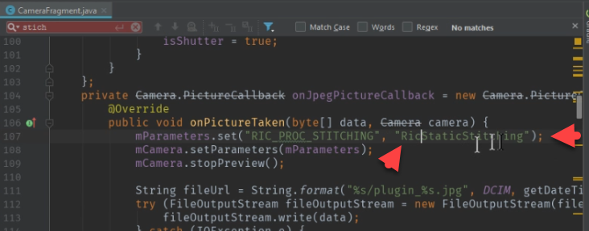
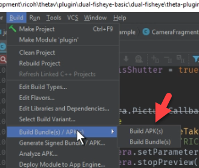
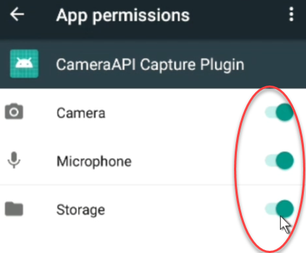
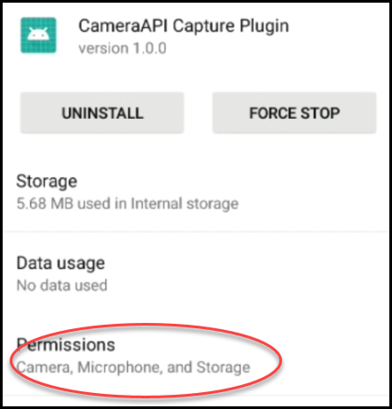
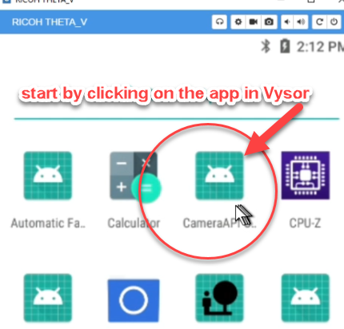

My First Plug-in
================

.. index:: dual-fisheye

`Step-by-step video <https://youtu.be/1ca7-EOiMCE>`_

.. image:: img/cover.png

RICOH Developer Connection GitHub
---------------------------------

Go to https://github.com/ricohapi

.. image:: img/ricoh-developer-connection.png

Locate theta-plugin-camera-api-sample
-------------------------------------

.. image:: img/theta-plugin-camera-api.png

https://github.com/ricohapi/theta-plugin-camera-api-sample

Download, Unzip, Open in Android Studio
---------------------------------------

.. image:: img/open.png

Go to the plugin folder in your Project view.

.. image:: img/plugin-studio.png

Open ``CameraFragment``
-----------------------

.. image:: img/camerafragment.png

Find ``RIC_PROC_STITCHING``
---------------------------

At roughly line 107, look for parameter ``RIC_PROC_STITCHING``.

Change to ``RicNonStitching``
-----------------------------

Reference the RICOH official API documentation to find the 
values for stitching.

Use ``RicNonStitching``.

https://api.ricoh/docs/theta-plugin-reference/camera-api/

Change filename
---------------

To help with testing, change the filename string from plugin to *fisheye*.

.. image:: img/filename.png

Change ``RIC_PROC_STITCHING`` in ``takePicture``
------------------------------------------------

In ``takePicture``, look for ``RIC_PROC_STITCHING``.  Change the value
to ``RicNonStitching``.

Change Picture ``setPictureSize``
---------------------------------

.. code-block:: java

    public void takePicture() {
        if (!isCapturing) {
            isCapturing = true;
            isShutter = false;

            mParameters.setPictureSize(5792, 2896);

Save All and Build apk
----------------------

Locate apk and install
----------------------

.. image:: img/locate.png

Connect camera to your computer with a USB cable.

Use ``adb install plugin-debug.apk``

You can add the path to file by dragging and dropping the file icon onto your command prompt.

.. image:: img/install.png

Look for a *Success* after install.

.. image:: img/success.png

Note: Your camera needs to be in Developer Mode. You need to join the partner program to enable
Developer Mode. It's free to join the partner program as of Oct 2018.

Use Vysor to Set Permissions
----------------------------

Install `Vysor <http://vysor.io/>`_.

Go to *Settings*.

.. image:: img/vysor-01.png

Go to Apps
----------

.. image:: img/vysor-apps.png

Select CameraAPI Capture Plugin
-------------------------------

.. image:: img/vysor-camera.png

Select Permissions
------------------

.. image:: img/vysor-permissions.png

Enable Camera, Microphone, Storage
----------------------------------

Confirm that Permissions are enabled.

Take Picture
------------

You can now use Vysor to start the plug-in with the camera still attached to USB.

If you want to use the camera untethered, you must use the RICOH Desktop app 
to set the default plug-in to launch. There is additional information on 
setting the default plug-in in the 
`THETA V Plugin Development Community Guide <http://theta360.guide/plugin-guide/use/>`_.

.. image:: img/vysor-perm-start.png

View Images
-----------

Connect the THETA V to your computer with a USB cable.  You can view the new images you just took
with a new image viewer. The THETA acts like a normal camera or mobile phone.  

The THETA is called, *RICOH THETA V*. The images are in `Fixed storage > DCIM`.

.. image:: img/view-pictures.png

You can view the images by double-clicking on them. Here's what a sample 
looks like in Photos.

.. image:: img/view-test.png

You can also check the properties for image details.

.. image:: img/view-details.png

You can view the images in Vysor using the file manager.

.. image:: img/view-vysor.png
